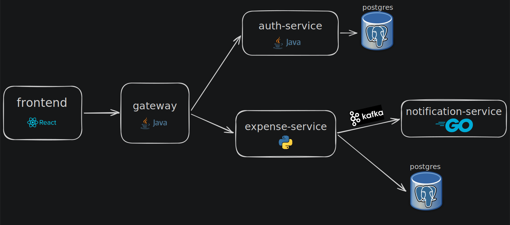

Aplikacja rozliczeń grupowych wydatków

## Uruchomienie

```bash
docker compose up --build
```

- Aplikacja: http://localhost:3000
- Skrzynka mailowa (powiadomienia): http://localhost:8025

## Zgodność z wytycznymi BD

### Model relacyjny

Dane przechowywane w PostgreSQL w dwóch bazach:

| Baza | Tabele |
|------|--------|
| `auth_db` | `users` |
| `expense_db` | `groups`, `group_members`, `expenses`, `expense_splits` |

Schematy: `auth-service/src/main/resources/schema.sql`, `expense-service/app/schema.sql`.

Relacje: klucze obce (`group_members` → `groups`, `expenses` → `groups`, `expense_splits` → `expenses`), ograniczenia UNIQUE i CHECK.

### Brak ORM - SQL w kodzie

- **auth-service** (Java/Spring): `UserDao` z osadzonymi zapytaniami SQL przez `JdbcTemplate` (bez JPA/Hibernate).
- **expense-service** (Python/FastAPI): `psycopg2` + stałe `SQL_*` w routerach (bez SQLAlchemy).

### UI operatorski

Frontend (React) wyświetla **imiona** użytkowników, nazwy grup i kody grup (klucz biznesowy 5 znaków), a nie wewnętrzne UUID ani indeksy surrogate w formularzach. Operator:

- wybiera grupę z listy (bez wpisywania ID),
- widzi członków grupy po imieniu,
- kopiuje kod grupy jednym kliknięciem,
- dodaje wydatek bez podawania identyfikatorów osób (podział równy między członków).

## Architektura

Mikroserwisy: `auth-service`, `expense-service`, `gateway`, `frontend`, `notification-service` (Kafka + e-mail).
